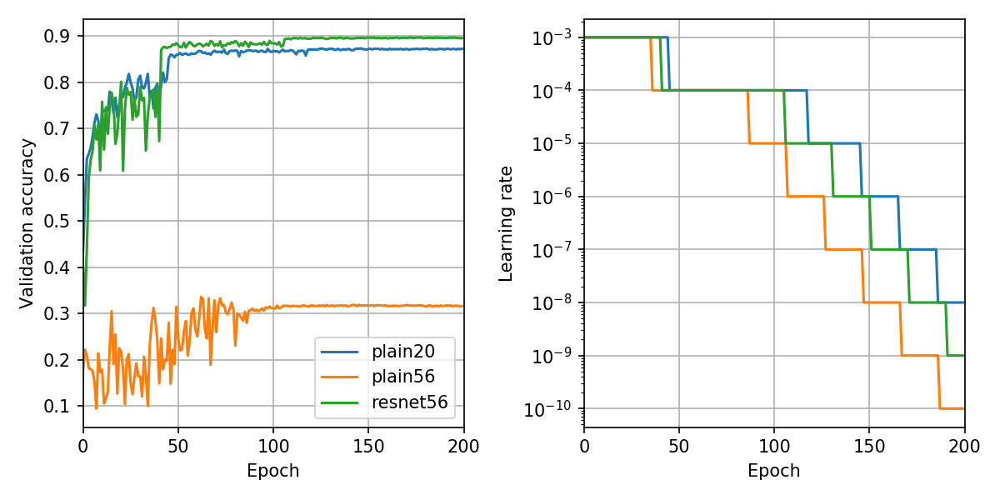

## TensorFlow CIFAR-10 ResNet

Basic residual network for CIFAR-10 classification from [Deep Residual Learning for Image Recognition](https://arxiv.org/abs/1512.03385).
Uses TensorFlow and Keras.

## Results

Wow, it's true! Residual connections really do make a magical
difference for deep nets.

* `plain20`: 20-layer network without residual connections. Trains fine.
* `plain56`: 56-layer network without residual connections. Does terribly.
* `resnet56`: 56-layers network *with* residual connections.
  Performance matches and exceeds 20-layer network.



## Usage

### Setup

```bash
$ pipenv sync
```

### Training

```bash
$ pipenv run python -m resnet.train with net=resnet20
```
